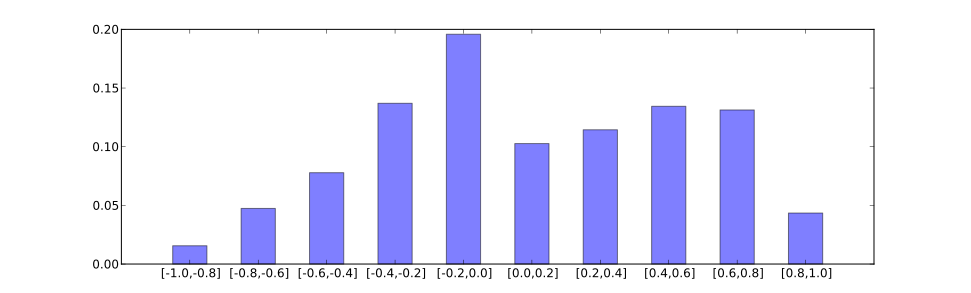

# nlp-util
Random utilities for NLP. Many of them were designed for MT (Machine Translation) experiments, but they can still be used for general purposes.

## Corpus Preprocessing

| Corpus Name | Script | Description |
| :---------- | :----- | :---------- |
| [ICWSM 2009 Spinn3r Blog Dataset](#icwsm-2009-spinn3r-blog-dataset) | Spinn3r-2009-extract.py | Extract select (and clean) text |
| [MSLT (Microsoft Speech Language Translation)](#mslt-microsoft-speech-language-translation) | MSLT-repack.sh, MSLT-extract.py | Extract monolingual/parallel data |
| [PPDB (Paraphrase Database)](#ppdb-paraphrase-database) | PPDB-extract.py | Extract select paraphrases |

## Statistics and Analysis

| Name | Script | Description |
| :--- |:----- | :---------- |
| [Word Count](#word-count) | word-count.py | Count (OOV/IV) words |
| [Probability Histogram](#probability-histogram) | probability-histogram.py | Generate a probability histogram |
| [Vertical Statistics](#vertical-statistics) | vertical-statistics.py | Calculate statistics vertically for values (with fixed patterns) |
| [Sequence Diff](#sequence-diff) | sequence-diff.py | Compare sequences and display diffs |
| [Bitext Identical Pairs](#bitext-identical-pairs) | bitext-identical-pairs.py | Detect (and remove) identical pairs from bitext |

#### [ICWSM 2009 Spinn3r Blog Dataset](http://www.icwsm.org/data/)
```
Usage:    Spinn3r-2009-extract.py [-h] -f FILE [FILE ...] [-l LANGUAGES [LANGUAGES ...]]
                                  -e ELEMENTS [ELEMENTS ...] [-u] [-c]
Examples: python Spinn3r-2009-extract.py -f BLOGS-tiergroup-1.tar.gz -e title description -l en -u -c > output.en
Optional arguments:
  -f FILE [FILE ...], --file FILE [FILE ...]
                        Spinn3r tar.gz file(s)
  -l LANGUAGES [LANGUAGES ...], --languages LANGUAGES [LANGUAGES ...]
                        language(s) to be extracted (e.g. en)
  -e ELEMENTS [ELEMENTS ...], --elements ELEMENTS [ELEMENTS ...]
                        element(s) to be extracted (e.g. title, description)
  -u, --unescape        unescape text (e.g. "&amp;"->"&") (default: False)
  -c, --clean           clean text (drop <*>/URLs, condense spaces) (default: False)
```

#### [MSLT (Microsoft Speech Language Translation)](https://github.com/MicrosoftTranslator/MSLT-Corpus)
1. Repack MSLT text (Python has an issue in handling original zip file).
```
bash MSLT-repack.sh /absolute/path/to/MSLT_Corpus.zip
```
2. Extract parallel or monolingual data from MSLT_Corpus.tgz
```
Usage:    MSLT-extract.py -f FILE -s SOURCE [-t TARGET] [-c CATEGORY] [-o OUTPUT]
Examples: python MSLT-extract.py -f MSLT_Corpus.tgz -s fr -t en -c dev -o MSLT.fr-en
          python MSLT-extract.py -f MSLT_Corpus.tgz -s fr > MSLT.fr
Optional arguments:
  -f FILE, --file FILE  input repacked tgz file
  -s SOURCE, --source SOURCE
                        source language (e.g. fr)
  -t TARGET, --target TARGET
                        target language (e.g. en)
  -c CATEGORY, --category CATEGORY
                        dev or test? (default: dev)
  -o OUTPUT, --output OUTPUT
                        output file (used for parallel data)
```

#### [PPDB (Paraphrase Database)](http://paraphrase.org/#/download)
```
Usage:    PPDB-extract.py [-f FILE] [-a FEATURE] [-t THRESHOLD] [-e ENTAILMENT]
Examples: gzip -dc ppdb-2.0-s-lexical.gz | python PPDB-extract.py -e Equivalence > output
Optional arguments:
  -f FILE, --file FILE  unzipped input file(s) (glob patterns are supported)
  -a FEATURE, --feature FEATURE
                        the feature used for filtering
  -t THRESHOLD, --threshold THRESHOLD
                        the threshold used for filtering (feature value >= threshold are kept)
  -e ENTAILMENT, --entailment ENTAILMENT
                        the entailment type(s) used for filtering (regular expression)
```

#### Word Count
It can also be used for counting/getting OOV (out-of-vocabulary) or IV (in-vocabulary) words.
```
Sample output:

,	63751725
.	61725497
the	60873114
to	35743675
and	34360371
a	29438769
of	28104862
i	27116174
in	20234743
"	16950626
```
```
Usage:   word-count.py [-i INPUT] [-w WHITE_LIST] [-b BLACK_LIST] [-s]
Example: cat file | python word-count.py -w list -s > output
         cat file | python word-count.py -b vocabulary > oov
         cat file | python word-count.py -w vocabulary > iv
Optional arguments:
  -i INPUT, --input INPUT
                        input file(s) (glob patterns are supported)
  -w WHITE_LIST, --white-list WHITE_LIST
                        only count words in the write list
  -b BLACK_LIST, --black-list BLACK_LIST
                        ignore words in the black list
  -s, --statistics      print statistics (default: False)
```

#### Probability Histogram
- Dependency: [NumPy](http://www.numpy.org/)
```
Sample output:

-1.0	0.015589
-0.8	0.047416
-0.6	0.077869
-0.4	0.137002
-0.2	0.195826
0.0	0.102647
0.2	0.114418
0.4	0.134427
0.6	0.131316
0.8	0.043490
1.0
```

```
Usage:   probability-histogram.py [-i INPUT] [-c COLUMN] [-n] [-l LOWER] [-u UPPER] [-b BINS] [-p]
Example: cat file | python probability-histogram.py -c 1 -n -p
Optional arguments:
  -i INPUT, --input INPUT
                        input file(s) (glob patterns are supported)
  -c COLUMN, --column COLUMN
                        the index of column that contains values (default: 0)
  -n, --normalize       normalize scores to [-1,1] (default: False)
  -l LOWER, --lower LOWER
                        the lower range of bins
  -u UPPER, --upper UPPER
                        the upper range of bins
  -b BINS, --bins BINS  the number of bins (default: 10)
  -p, --plot            plot the histogram (default: False)
```

#### Vertical Statistics
- Dependency: [NumPy](http://www.numpy.org/)
```
Sample input:

BLEU = 33.99, 64.8/42.0/30.6/23.3 (BP=0.911, ratio=0.915, hyp_len=22925, ref_len=25061)
BLEU = 32.78, 65.5/40.9/28.2/20.2 (BP=0.933, ratio=0.935, hyp_len=55947, ref_len=59823)
BLEU = 37.29, 68.7/44.5/31.8/23.2 (BP=0.963, ratio=0.963, hyp_len=76162, ref_len=79064)

Sample output:

mean	BLEU = 34.69, 66.3/42.5/30.2/22.2 (BP=0.936, ratio=0.938, hyp_len=51678, ref_len=54649)
median	BLEU = 33.99, 65.5/42.0/30.6/23.2 (BP=0.933, ratio=0.935, hyp_len=55947, ref_len=59823)
```
```
Usage:   vertical-statistics.py [-i INPUT] [-l] [-c COLUMN]
                                [-m {mean,min,max,range,median,sum,std,var,sub} [{mean,...,sub} ...]]
Example: cat file1 file2 file3 | python vertical-statistics.py -l -m mean median > output
Optional arguments:
  -i INPUT, --input INPUT
                        input file(s) (glob patterns are supported)
  -m, --metrics {mean,min,max,range,median,sum,std,var,sub} [{mean,min,max,range,median,sum,std,var,sub} ...]
                        statistic metrics (default: ['mean'])
  -l, --label           print metrics labels (default: False)
  -c COLUMN, --column COLUMN
                        analyse a specified whitespace-split column (c-th) (default: None)
```

#### Sequence Diff
```
Sample output:

1 CONST-1	you can remove it .
....................................................................................................
1 SEQUE-B	you can take it off .
1 SEQUE-1	you can withdraw .
====================================================================================================
3 CONST-1	but , let 's face it , underachiever , dead @-@ end life , okay ?
....................................................................................................
3 SEQUE-B	let us be frank . he 's got a lousy job , he ain 't got no prospects .
           	                     ^  ----                 -----------           -
3 SEQUE-1	let us be frank . he has a lousy job , he no longer has any prospect .
           	                     ^^                     +++++++++++++++
====================================================================================================
```
```
Usage:   sequence-diff.py -f FILE [FILE ...] [-c CONST [CONST ...]] [-d] [-v]
Example: python sequence-diff.py -c source_file -f reference_file hypothesis_file
Optional arguments:
  -f FILE [FILE ...], --file FILE [FILE ...]
                        input files of sequences to be compared
                        (the first file is the base to be compared with, such as reference translations)
  -c CONST [CONST ...], --const CONST [CONST ...]
                        files of sequences not participating in comparison,
                        such as source sentences to be translated
  -d, --condense        condense the comparison of multiple sequences without showing diffs (default: False)
  -v, --verbose         always print the base sequence (default: False)
```

#### Bitext Identical Pairs
```
Sample output:

43	similarity=0.97
FILE-1	Ernesto tagged you in his photo: "with Rizal and the national photo bomber!"
FILE-2	Ernesto tagged you in his photo: ‘With Rizal and the national photobomber!’
====================================================================================================
102	similarity=0.95
FILE-1	"good morning, sir.
FILE-2	“Good morning, sir.
====================================================================================================
2000 bitext pairs were read
182 pairs (9.10%) were identical with threshold=0.90
```
```
Usage:   bitext-identical-pairs.py [-h] -f FILE FILE [-o OUTPUT OUTPUT] [-t THRESHOLD] [-l] [-v]
Example: python bitext-identical-pairs.py -f file1 file2 -o output1 output2 -t 0.9 -l -v
Optional arguments:
  -f FILE FILE, --file FILE FILE
                        input bitext files to be compared (default: None)
  -o OUTPUT OUTPUT, --output OUTPUT OUTPUT
                        output bitext files without identical pairs (default: None)
  -t THRESHOLD, --threshold THRESHOLD
                        similarity threshold to determine identity ([0,1]) (default: 0.9)
  -l, --lowercase       compare lowercased sequences (default: False)
  -v, --verbose         print identical pairs (default: False)
```
